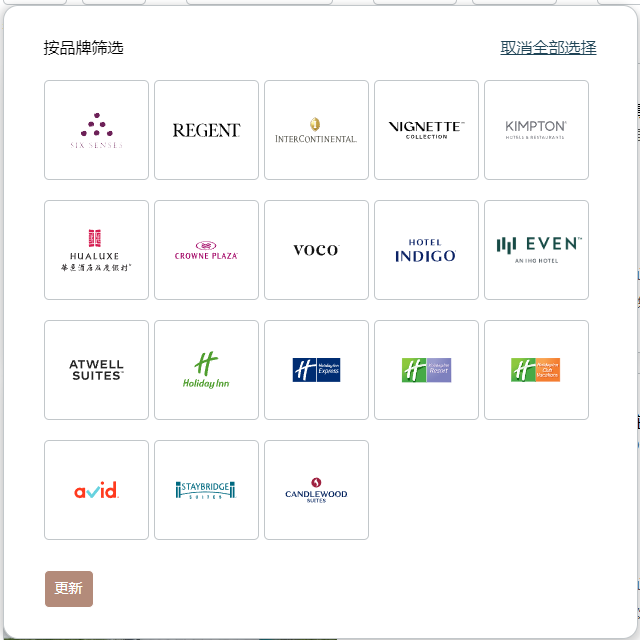

> 出行住酒店的小知识

## 分类

> 推荐视频：[【奶拆的行政酒廊】星级酒店？已过时的评级体系
](https://www.bilibili.com/video/BV14E411N7fS/?vd_source=f5b80afff28141fb9657237f68404670)

> 推荐视频：[【硬核旅行攻略】你知道这些酒店牌子是什么级别的吗?【第1期-奢华级】](https://www.bilibili.com/video/BV1QE411h79m/?vd_source=f5b80afff28141fb9657237f68404670)

> 推荐视频：[【硬核旅行攻略】哪些才是真正的五星级酒店品牌？（酒店品牌第二期）](https://www.bilibili.com/video/BV1QJ411q7qk/?vd_source=f5b80afff28141fb9657237f68404670)

- 以下价绍分为：某某酒店集团-某某酒店品牌

- 全球没有统一的标准，比如我们最熟知的五星到一星（实际上是二星），有些地方还能看到六星、七星；但实际上国标没有六星，福布斯的五星又非常少，不同的标准水平差异较大，这里采取如下的标准：

  - 顶级奢华
  - 奢华
  - 豪华五星
  - 高级五星
  - 基础五星
  - 四星（中-高端）
  - 经济型中端
  - 快捷酒店

## 国际集团

> 推荐文章：[收藏：世界各大酒店集团及旗下品牌](https://zhuanlan.zhihu.com/p/29279731)

> 推荐文章：[世界几大酒店集团及其旗下品牌的定位是怎样的？](https://www.zhihu.com/question/46658717)的第一个回答

一、万豪集团——Marriot International Inc

喜达屋酒店集团——Starwood Hotels & Resorts Worldwide Inc，被万豪收购，目前万豪成为世界第一的酒店集团

  - 顶级奢华

    - 丽思卡尔顿隐世（全球三家，大陆没有）
    - 宝格丽（北上各一家）

  - 奢华

    - 丽思卡尔顿
    - 瑞吉（天津瑞吉排雷）

  - 豪华五星

    - JW
    - W
    - 豪华精选
    - 艾迪逊（顶配全季）
    
  - 高级五星

    - 万豪
    - 喜来登
    - 威斯汀
    - 艾美
    - 傲途格
    - 万丽

  - 基础五星

    - 万怡

二、锦江国际酒店集团【国内部分讲，见后文】

三、希尔顿酒店——Hilton Worldwide

  - 奢华

    - 华尔道夫

  - 豪华五星

    - 康莱德

  - 高级五星

    - 希尔顿嘉悦里
    - 希尔顿格芮精选
    - 希尔顿

  - 基础五星

    - 希尔顿逸林（热巧克力曲奇）

四、洲际酒店——InterContinental Hotels Group PLC

  - 顶级奢华

    - 六善（青城山）

  - 奢华

    - 丽晶

  - 豪华五星

    - 洲际

  - 高级五星

    - 英迪格
    - 华邑
    - 金普顿

  - 基础五星

    - 皇冠假日`

五、温德姆酒店——Wyndham Worldwide

六、雅高集团——Accor SA

  - 豪华五星

    - 费尔蒙
    - 索菲特
    - 美憬阁

  - 基础五星

    - 铂尔曼

七、华住酒店集团【国内部分讲，见后文】

八、精选国际酒店——Choice Hotels International Inc

九、印度OYO

十、首旅如家酒店集团【国内部分讲，见后文】

十一、贝斯特韦斯特集团——Best Western International

名声在外：凯悦酒店集团——Hyatt Hotels Corp

  - 顶级奢华

    - 阿丽拉（阳朔、安吉、乌镇）

  - 奢华

    - 柏悦

  - 豪华五星

    - 安达仕
    - 君悦（每个城市只在地标开一家）
    - 全球奢华精品酒店（与凯越合作）

  - 五星

    - 凯悦
    - 凯悦尚萃
    - 凯悦臻选

名声在外：四季酒店

其他：

  - 顶级奢华

    - 安缦
    - 文华东方
    - 虹夕诺雅（星野集团旗下）
    - 半岛（北上港各一家）

  - 奢华

    - 瑰丽
    - 悦榕庄（与雅高合作）
    - 四季
    - 卓美亚（即阿拉伯的帆船酒店）

  - 豪华五星

    - 香格里拉（香格里拉旗下）
    - 尼依格罗（全球酒店联盟成员——九龙仓集团）
    - 安纳塔拉（全球酒店联盟成员）
    - 美高梅（钓鱼台美高梅旗下）
    - 界（星野集团旗下）
    - 立鼎世（联盟，非品牌）

  - 高级五星

    - 嘉里（香格里拉旗下）
    - 凯宾斯基（全球酒店联盟成员）
    - 马哥孛罗（全球酒店联盟成员——九龙仓集团）
    - 明宇豪雅（国产）
    - 悦椿
    - 万达文华

  - 基础五星

    - 开元名都

## 国内集团

> 推荐文章：[围观中国酒店集团的三巨头！](https://zhuanlan.zhihu.com/p/114145752)

1. 锦江国际酒店集团

2. 华住酒店集团

3. 首旅如家酒店集团

## 测评

1. 上海宝龙丽笙

- 优点：自助早餐特别好；香氛很讨人喜欢；插座比较多；床很宽很大；房间大小布局色调都符合预期；有泳池

- 缺点：窗户隔音不好，晚上能听到外面施工的声音；电梯比较慢，刷卡之后不自动显示楼层；吹风机不是很好；外卖只能送在楼下桌子或者美团外卖柜，不清楚打电话能不能让酒店服务人员送上门；某天看到自助早餐餐台有蟑螂在爬，恐怖；泳池对外开放，人并不少

- 心得：需要备注高楼层，朝向等，否则不优先安排；门是推的不是拉的；