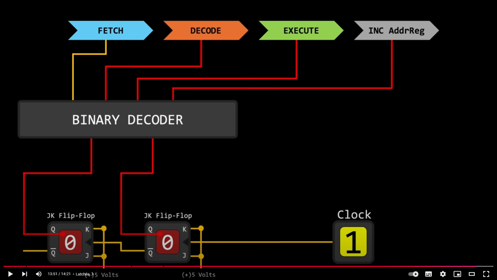

> 计算机是怎么运行的，回答这个问题需要的知识可太多了

## 前言

要从哪里开始回答这个问题，有很多个起点，有高一些的层级，有低一些的层级。思前想后，我决定以数字电路开始解释，本来想以半导体开始的，但觉着这个有点太底层太原始了，不如将数字电路作为起点开始讲这个故事。选择数字电路有几个原因：

1. 数字电路以下基本使用弱电分析比较多，个人感觉更接近电路的知识
2. 数字电路以上开始将电平抽象为数字，变为逻辑的0和1，更接近计算机的知识
3. 实际上数字电路并不是目前软件硬件的分界线，软硬件的分界线应该是指令集

所以这里先从数字电路开始讲述，讲解到和数学相关的算法之后，我们再从数字电路往前看，讲解如何从半导体到数字电路的。

---

## 硬件

> 硬件是计算机的身体，软件是计算机的大脑；这里的东西都是死的，没有动起来

### 从数字电路说起

（前置知识：三极管的特性可以使得多个三极管经过排列变为满足特性要求的电路，这一层抽象形成了数字电路的基本单元）

门电路（与、或、非）是一个经过抽象的电路单元，能够根据输入的信号（高电平为1，低电平为0），来决定输出的信号，这就是最基本的数字电路的组成单元。

门电路经过特定的组合，可以变为满足要求的其他电路：

- 半加器，全加器
- 多路选择器
- SR触发器，JK触发器等
- 等等

这些电路，进一步抽象一层，变成了CPU的几个基本组成部分，比如：

- 运算器ALU
- 控制器
- 寄存器
- 等等

### 存储部分

有以下这么几个用来存数据的器件：

- 硬盘：断电后数据不丢失
  - HDD（机械硬盘）：使用磁盘存储数据，用读写头读写数据
  - SSD（固态硬盘）：闪存芯片存储数据，电子信号读写数据（有点像内存了）
- ROM：
  - 讲内存之前的一个有趣的东西，因为ROM总和RAM进行对比，所以放在这里讲述
  - ROM断电后数据不丢失，而且只能读不能写
  - 一般用于BIOS和UEFI中，关注度较少
  - 发展到EPROM，EEPROM，闪存后，可以变成SSD
- 内存（RAM）：断电后数据丢失
  - DRAM：1T1C，需要周期性刷新
    - 一个晶体管一个电容，使用电容存储数据，晶体管负责控制
    - 单独做在一个器件上面，通过主板与CPU连接，就是我们经常提到的内存
    - DDR，就是DDRAM，第一个D是双通道的意思
  - SRAM：6T，不需要周期性刷新
    - 组成部分为6个晶体管，这里就基本上是使用数字电路制造的了，一般和芯片做在一起
    - 由于和芯片做在一起了，也就成为了大家口中的CPU缓存（L1, L2, L3）或者GPU缓存
  - 所以CPU取信息的时候，优先从缓存一层一层往下取，都没有命中再去内存寻找
  - 这里的寻找原则就是我们学过的算法，“最近最少使用（Least Recently Used, LRU）”或者“最少频率使用（Least Frequently Used, LFU）”，等等
- 寄存器：
  - CPU直接使用的东西，基于触发器制作

---

## 软件

> 以上的电路都是死的，一个能够让电路动起来的核心的东西，叫做**时钟（Clock）**

时钟的来源是晶振，这里也先不细讲（todo），总之先认为时钟信号可以给一个稳定的周期方波信号，其他器件连接到这个信号，或者通过分频器，倍频器等连接到这个信号，拿CPU来讲，这个信号可以通过JK触发器（JK Flip-Flop）变为一个2位二进制数字，然后通过二进制解码器（学过的2-4解码器，3-8解码器等），驱动CPU执行4个阶段之中的一个，并不断循环。

### CPU的执行过程

这个应该是是很多人都熟悉的领域了，CPU的执行过程一般为以下几个阶段：

- 取指令
- 解码
- 执行
- 指令计数器增加

#### 取指令

#### 解码

#### 执行

#### 指令计数器增加

### CPU的指令从哪里来

这部分内容熟悉的人应该更多了，那就是经典的从上层代码到指令的过程，拿C++来说：

- 预编译
- 编译
- 汇编
- 链接

#### 预编译

#### 编译

#### 汇编

#### 链接
